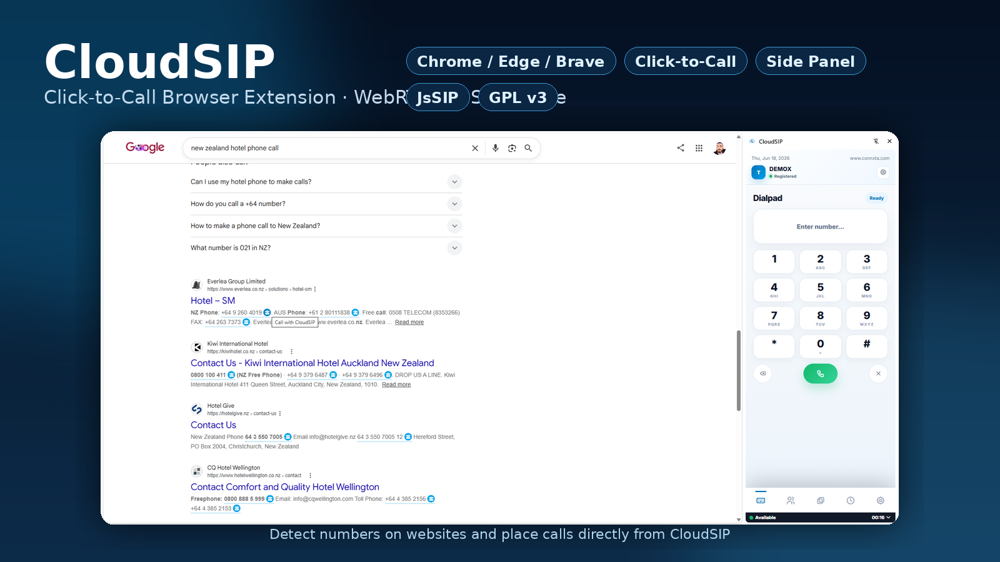

# CloudSIP Browser Extension

CloudSIP Browser Extension packages the CloudSIP WebRTC SIP softphone as a Chromium Manifest V3 extension. It gives agents a compact side-panel phone, website click-to-call buttons, SIP registration, contacts, call history, local recordings, and diagnostics without requiring a backend or build step.

## Features

### Softphone and SIP calling

- Register a SIP extension over WebSocket/WebRTC from the extension UI.
- Place outbound calls from the dialpad, contacts, call logs, or detected website numbers.
- Answer, reject, hang up, mute, hold, and resume calls.
- Send DTMF tones from the in-call keypad.
- Use blind transfer, consult transfer, consult calls, and conference controls where supported by the SIP server.
- Manage multiple active lines and return to the active call from the mini call banner.

### Browser extension workflow

- Opens as a Chrome/Edge side panel when the extension icon is clicked.
- Falls back to a focused popup window on browsers that do not support the side panel API.
- Injects an optional click-to-call content script into webpages.
- Detects `tel:` links and phone-number-like text, then adds a CloudSIP call button beside valid numbers.
- Supports rescanning the current page from Settings after dynamic page content loads.

### Contacts and call history

- Add, edit, delete, search, and favorite local contacts.
- Start calls directly from saved contacts.
- View grouped call logs and call-thread timelines.
- Clear call logs from Settings when needed.

### Audio, recording, and diagnostics

- Request microphone permission from the extension UI.
- Select microphone and speaker devices when supported by the browser.
- Test microphone and speaker output from Settings.
- Show live microphone and remote-audio meters during calls.
- Record calls locally and download recordings.
- Use WebRTC diagnostics for browser support, permission state, SIP registration, WebSocket state, ICE state, and active media-track information.

### Preferences and productivity

- Configure SIP domain, WebSocket URL, SIP URI, extension, display name, and password locally.
- Toggle auto answer, auto recording, auto hold on line switch, click-to-call, and click-to-call auto dial.
- Switch between light and dark themes.
- Use keyboard shortcuts for common desktop phone actions.
- Reset settings, logs, and browser-local data from the UI.

## Installation

See [`INSTALLATION.md`](INSTALLATION.md) for detailed installation, update, configuration, testing, and troubleshooting steps.

Quick install for development/testing:

1. Open `chrome://extensions` or `edge://extensions`.
2. Enable **Developer mode**.
3. Click **Load unpacked**.
4. Select this `extension/` folder.
5. Click the CloudSIP toolbar icon to open the side panel.
6. Open **Settings**, allow microphone access, and enter SIP/WebRTC credentials.

## Browser support

- Google Chrome
- Microsoft Edge
- Brave and other Chromium-based browsers with Manifest V3 support

Chrome or Edge are recommended because side panel, microphone permissions, and audio-output selection support vary by browser.

## Requirements

- A SIP server that supports SIP over secure WebSocket and WebRTC media.
- Valid SIP extension credentials.
- Microphone permission in the browser.
- HTTPS/WSS SIP signaling in production environments.

## Data storage and privacy

CloudSIP stores extension data locally in the browser profile:

- SIP settings and preferences are stored locally.
- Contacts and call logs are stored locally.
- Recordings are stored locally until downloaded or cleared.
- No backend service is required by default.

Do not commit real SIP passwords, production credentials, or customer call data to this repository.

## Local vendor assets

Chrome extensions do not allow remote scripts by default. JsSIP is bundled locally at `assets/vendor/jssip.min.js`, and extension pages load local assets only.

## Known limitations

- This extension targets Chromium Manifest V3 browsers; Firefox is not supported by this package.
- Click-to-call detection is heuristic and intentionally skips form fields, links, scripts, code blocks, dates, and prices where possible.
- Some SIP features, including transfers and conferencing, depend on SIP server capabilities and configuration.
- CloudSIP is not for emergency calling. Do not rely on it for emergency services or life-safety communications.
